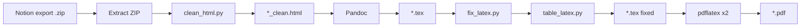

# Notion HTML → PDF (LaTeX pipeline)

[](https://pypi.org/project/notion2tex/)
[](https://opensource.org/licenses/MIT)
[](https://adducec03.github.io/Notion2Tex/)

Convert a **Notion HTML export** into a printable **PDF** with correct heading hierarchy, math, tables, images, and a clickable table of contents.

Designed for large course notes exported from Notion with KaTeX formulas, nested toggles, and `simple-table` blocks.

**Full documentation:** [adducec03.github.io/Notion2Tex](https://adducec03.github.io/Notion2Tex/) · [PyPI](https://pypi.org/project/notion2tex/)

---

## Quick start

### Requirements

| Tool | Purpose |
|------|---------|
| **Python 3.10+** | CLI and HTML/LaTeX processing |
| **Pandoc 3.x** | HTML → LaTeX |
| **pdflatex** (TeX Live or MacTeX) | PDF build |

All processing runs **on your machine** — nothing is uploaded.

### Install

```bash
pip install notion2tex
notion2tex --check          # verify pandoc + pdflatex
```

Install Pandoc: https://pandoc.org/installing.html  

Install TeX (includes `pdflatex`): https://www.tug.org/texlive/ (or MacTeX on macOS). A minimal TeX Live install is enough; if compilation fails on a missing `.sty` file, run `tlmgr install <package>` (e.g. `tlmgr install soul ulem float`).

**Development install** (clone + editable):

```bash
git clone https://github.com/adducec03/Notion2Tex.git
cd Notion2Tex
python3 -m venv .venv && source .venv/bin/activate
pip install -e ".[dev]"
```

### Convert

Pass the **`.zip` file** from Notion (HTML export):

```bash
notion2tex "/path/to/Export.zip"
```

Or a single `.html` already next to its asset folder:

```bash
notion2tex "/path/to/export/Page Name.html"
```

**Output** (for `Automata.html`): `Automata.tex`, `Automata.pdf`, `Automata.log` (plus the original HTML). Intermediate files are removed after a successful run.

```bash
notion2tex --help
notion2tex Export.zip --tex-only       # LaTeX only, no pdflatex
notion2tex Export.zip -v               # show compiler output
notion2tex Export.zip --no-color       # plain output
```

See [Usage](https://adducec03.github.io/Notion2Tex/usage/) and [Troubleshooting](https://adducec03.github.io/Notion2Tex/troubleshooting/) on the docs site.

---

## Documentation

| Resource | URL |
|----------|-----|
| **Docs site** (guides & tutorials) | https://adducec03.github.io/Notion2Tex/ |
| **PyPI package** | https://pypi.org/project/notion2tex/ |
| **Source & issues** | https://github.com/adducec03/Notion2Tex |

Build the docs locally:

```bash
pip install -r docs/requirements.txt
mkdocs serve    # http://127.0.0.1:8000
```

---

## Pipeline overview



1. **clean_html** — Notion HTML fixes (toggles, tables, math, properties).
2. **Pandoc** — HTML → LaTeX.
3. **fix_latex** — TOC, cover, figures, tables, math, page numbering.
4. **pdflatex** (×2) — PDF + table of contents.

Details: [Pipeline](https://adducec03.github.io/Notion2Tex/pipeline/).

---

## Exporting from Notion

1. Export the page as **HTML** (Notion gives a `.zip`).
2. Run `notion2tex Export.zip`.
3. Do not rename files inside the export before converting.

---

## Project structure

```
Notion2Tex/
├── notion2tex/       # Python package (CLI + pipeline)
├── tests/
├── docs/             # MkDocs source → GitHub Pages
├── n2t.sh            # Optional shell wrapper
└── pyproject.toml
```

Module reference and customization: [Development](https://adducec03.github.io/Notion2Tex/development/).

---

## Website (GitHub Pages)

After pushing `main` with `.github/workflows/docs.yml`:

1. On GitHub: **Settings → Pages → Build and deployment → Source: GitHub Actions**.
2. The workflow deploys MkDocs to **https://adducec03.github.io/Notion2Tex/**.

Optional alternative: [Read the Docs](https://readthedocs.org/) using `.readthedocs.yaml` in the repo root.

---

## License

MIT — see [LICENSE](LICENSE).
