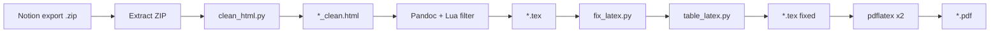

# Notion2Tex

[](https://pypi.org/project/notion2tex/)
[](https://opensource.org/licenses/MIT)
[](https://adducec03.github.io/Notion2Tex/)

Convert a **Notion HTML export** into a printable **PDF** with correct heading hierarchy, math, tables, images, and a clickable table of contents.

Designed for large course notes exported from Notion with KaTeX formulas, nested toggles, and `simple-table` blocks — and faithful to Notion's own formatting: colored/highlighted text, underline/strikethrough, multi-column layouts, callout and quote blocks, syntax-highlighted code, image alignment, and an optional **dark mode** (`--dark`).

**Full documentation:** [adducec03.github.io/Notion2Tex](https://adducec03.github.io/Notion2Tex/) · [PyPI](https://pypi.org/project/notion2tex/)

---

## Quick start

### Requirements

| Tool | Purpose |
|------|---------|
| **Python 3.10+** | CLI and HTML/LaTeX processing |
| **Pandoc 3.x** | HTML → LaTeX (a recent version matters — see note below) |
| **pdflatex** (TeX Live or MacTeX) | PDF build, with `tcolorbox`, `framed`, `soul`/`ulem`, `lmodern` |

> **Pandoc version:** the pipeline relies on a Lua filter and MathML-based math handling that only work correctly on **fairly recent Pandoc builds**. Debian/Ubuntu's packaged `pandoc` can be much older and will silently drop formatting or math; if you hit that, install a current release directly from [pandoc.org](https://pandoc.org/installing.html) or use the Docker image below, which always pins a known-good version.

Only your shell, Pandoc, and `pdflatex` run during conversion — the pipeline makes **no outbound network calls** except to download images that Notion itself only linked to (page covers, "image from link" blocks, bookmark previews); everything else stays on your machine.

### Install

```bash
pip install notion2tex
notion2tex --check          # verify pandoc + pdflatex
```

Install Pandoc: https://pandoc.org/installing.html  

Install TeX (includes `pdflatex`): https://www.tug.org/texlive/ (or MacTeX on macOS). A minimal TeX Live install is enough; if compilation fails on a missing `.sty` file, run `tlmgr install <package>` (e.g. `tlmgr install soul ulem float tcolorbox framed`).

### Install with Docker (no local Pandoc/TeX needed)

No clone required — pull the published image and point the wrapper script at any file on disk:

```bash
curl -O https://raw.githubusercontent.com/adducec03/Notion2Tex/main/scripts/notion2tex-docker.sh
chmod +x notion2tex-docker.sh
./notion2tex-docker.sh /path/to/Export.zip
```

(Windows: `scripts/notion2tex-docker.ps1`.) The image is pulled automatically on first run; output (`.pdf`, `.tex`, `.log`) is written right next to the input file. The image bundles a pinned, known-good Pandoc release plus a full TeX toolchain.

Working from a clone of this repo instead? See [DOCKER.md](DOCKER.md) for `docker compose`/local-build instructions and more examples.

**Development install** (clone + editable):

```bash
git clone https://github.com/adducec03/Notion2Tex.git
cd Notion2Tex
python3 -m venv .venv && source .venv/bin/activate
pip install -e ".[dev]"
```

### Convert

Pass the **`.zip` file** from Notion (HTML export):

```bash
notion2tex "/path/to/Export.zip"
```

Or a single `.html` already next to its asset folder:

```bash
notion2tex "/path/to/export/Page Name.html"
```

**Output** (for `Automata.html`): `Automata.tex`, `Automata.pdf`, `Automata.log` (plus the original HTML). Intermediate files are removed after a successful run.

```bash
notion2tex --help
notion2tex Export.zip --tex-only       # LaTeX only, no pdflatex
notion2tex Export.zip -v               # show compiler output
notion2tex Export.zip --no-color       # plain output
notion2tex Export.zip --dark           # dark gray page, light text/colors
```

See [Usage](https://adducec03.github.io/Notion2Tex/usage/) and [Troubleshooting](https://adducec03.github.io/Notion2Tex/troubleshooting/) on the docs site.

---

## Documentation

| Resource | URL |
|----------|-----|
| **Docs site** (guides & tutorials) | https://adducec03.github.io/Notion2Tex/ |
| **PyPI package** | https://pypi.org/project/notion2tex/ |
| **Source & issues** | https://github.com/adducec03/Notion2Tex |

Build the docs locally:

```bash
pip install -r docs/requirements.txt
mkdocs serve    # http://127.0.0.1:8000
```

---

## Pipeline overview



1. **clean_html** — Notion HTML fixes (toggles, tables, math, properties, callouts, code languages) and downloads any image Notion only linked to (cover, "image from link", bookmark previews).
2. **Pandoc + Lua filter** — HTML → LaTeX; a bundled Lua filter (`notion_formatting.lua`) rebuilds columns, callouts, quotes, and bookmark cards, and re-injects colored/highlighted/underlined text that Pandoc's writer otherwise drops.
3. **fix_latex** — TOC, cover page, figures, tables, math, page numbering, chapter page breaks, running chapter header, dark theme (`--dark`).
4. **pdflatex** (×2) — PDF + table of contents.

Details: [Pipeline](https://adducec03.github.io/Notion2Tex/pipeline/).

---

## Exporting from Notion

1. Export the page as **HTML** (Notion gives a `.zip`).
2. Run `notion2tex Export.zip`.
3. Do not rename files inside the export before converting.

---

## Project structure

```
Notion2Tex/
├── notion2tex/       # Python package (CLI + pipeline)
│   └── filters/      # Pandoc Lua filter (formatting, columns, callouts...)
├── tests/
├── docs/             # MkDocs source → GitHub Pages
├── Dockerfile        # Optional containerized build (see DOCKER.md)
├── scripts/          # notion2tex-docker.sh/.ps1 — run the published image against any file, no clone needed
├── n2t.sh            # Optional shell wrapper
└── pyproject.toml
```

Module reference and customization: [Development](https://adducec03.github.io/Notion2Tex/development/).

---

## Website (GitHub Pages)

After pushing `main` with `.github/workflows/docs.yml`:

1. On GitHub: **[Settings → Pages](https://github.com/adducec03/Notion2Tex/settings/pages)** → **Build and deployment** → **Source: GitHub Actions** (required; without this the deploy step returns 404).
2. Re-run the workflow if the first run failed before Pages was enabled.
3. Site URL: **https://adducec03.github.io/Notion2Tex/**

Optional alternative: [Read the Docs](https://readthedocs.org/) using `.readthedocs.yaml` in the repo root.

---

## License

MIT — see [LICENSE](LICENSE).
