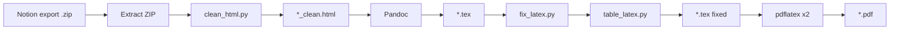

# Notion HTML → PDF (LaTeX pipeline)

Convert a **Notion HTML export** into a printable **PDF** with correct heading hierarchy, math, tables, images, and a clickable table of contents.

Designed for large course notes exported from Notion with KaTeX formulas, nested toggles, and `simple-table` blocks.

---

## Quick start

### Requirements

| Tool | Purpose |
|------|---------|
| **Python 3.10+** | CLI and HTML/LaTeX processing |
| **Pandoc 3.x** | HTML → LaTeX |
| **pdflatex** (TeX Live or MacTeX) | PDF build |

All processing runs **on your machine** — nothing is uploaded.

### Install (CLI)

From a clone of this repo:

```bash
cd /path/to/Notion2Tex
python3 -m venv .venv
source .venv/bin/activate   # Windows: .venv\Scripts\activate
pip install -e .
notion2tex --check          # verify pandoc + pdflatex
```

From PyPI (when published):

```bash
pip install notion2tex
```

Install Pandoc: https://pandoc.org/installing.html  

Install TeX (includes `pdflatex`): https://www.tug.org/texlive/ (or MacTeX on macOS). A minimal TeX Live install is enough; if compilation fails on a missing `.sty` file, run `tlmgr install <package>` (e.g. `tlmgr install soul ulem float`).

### Convert

Pass the **`.zip` file** you get when exporting from Notion (HTML format). The ZIP contains the page `.html` and an asset folder with the same name:

```bash
notion2tex "/path/to/Export.zip"
```

The ZIP is extracted to a folder with the same name (e.g. `Export.zip` → `Export/`), then the pipeline runs on the main page inside it.

You can still pass a single `.html` if it already sits next to its asset folder:

```bash
notion2tex "/path/to/export/Page Name.html"
```

Or use the wrapper script (after `pip install -e .`):

```bash
chmod +x n2t.sh   # once
./n2t.sh Export.zip
```

**Output** (for a page `Automata.html` inside `Export/`):

| File | Description |
|------|-------------|
| `Automata.html` | Original Notion export (unchanged) |
| `Automata.tex` | LaTeX source |
| `Automata.pdf` | Final PDF |
| `Automata.log` | pdflatex log (if PDF was built) |

Intermediate files (`_clean.html`, `.aux`, `.toc`, `.out`, …) are removed automatically after a successful run.

Files are written **next to the HTML** inside the extracted export folder.

**Options:**

```bash
notion2tex --help
notion2tex Export.zip --tex-only       # LaTeX only, no pdflatex
notion2tex Export.zip -v               # show compiler output
notion2tex Export.zip --no-color       # plain output (no colors or progress bars)
notion2tex Export.zip --extract-dir ./work   # custom extraction folder
```

---

## Setup (development)

```bash
python3 -m venv .venv
source .venv/bin/activate
pip install -e .
```

---

## Pipeline overview



1. **clean_html.py** — Fix Notion-specific HTML so Pandoc behaves predictably.
2. **Pandoc** — Convert cleaned HTML to a standalone LaTeX document.
3. **fix_latex.py** — Post-process LaTeX (math, sections, TOC, figures, tables).
4. **pdflatex** (twice) — Build PDF and refresh the table of contents / page numbers.

`notion2tex` (or `n2t.sh`) runs all four steps in order.

---

## Exporting from Notion

1. Open the Notion page (or workspace export).
2. Export as **HTML** (with subpages if needed). Notion delivers a **`.zip`** file.
3. Run `notion2tex Export.zip` — the tool extracts the archive and keeps paths intact (`Page.html` + `Page/` asset folder).
4. Do not rename or move files inside the export before converting; image paths in the HTML are relative to the `.html` file.

---

## Project structure

```
.
├── automata.html          # Example input: raw Notion HTML export
├── automata_clean.html    # Generated: cleaned HTML
├── automata.tex           # Generated: LaTeX
├── automata.pdf           # Generated: PDF
├── n2t.sh                 # Thin wrapper → notion2tex CLI
├── notion2tex/            # Installable Python package
│   ├── clean_html.py      # Step 1: HTML preprocessing
│   ├── fix_latex.py       # Step 3: LaTeX post-processing
│   ├── table_latex.py     # Table conversion (used by fix_latex)
│   ├── zip_export.py      # Extract Notion .zip, find main .html
│   ├── pipeline.py        # Full build orchestration
│   └── cli.py             # `notion2tex` command
├── pyproject.toml
└── .venv/                 # Optional virtual environment
```

### `clean_html.py`

Prepares Notion HTML before Pandoc:

| Step | What it does |
|------|----------------|
| Toggles → headings | Nested `<details>` become `<h1>`–`<h6>` (deepest first) |
| Table repair | Removes invalid `<div>` wrappers inside `<table>` so Pandoc emits real tables |
| Math | KaTeX `<annotation>` → MathML (inline) or `$$...$$` (display) |
| SVG removal | Drops SVG icons/images that break `pdflatex` |
| Emoji removal | Strips emoji characters |

```bash
python -c "from notion2tex.clean_html import clean_html_for_pandoc; clean_html_for_pandoc('automata.html', 'automata_clean.html')"
```

### `fix_latex.py`

Fixes Pandoc/Notion artifacts in the `.tex` file:

| Area | Fix |
|------|-----|
| Structure | Section numbering `1.` / `1.1.` / `1.1.1.`; unnumbered cover page |
| TOC | Inserts `\tableofcontents` after the cover; clickable PDF links (`hyperref`) |
| Figures | `[H]` placement so images stay in document order |
| Math | Escaped `\$...\$`, `\textbackslash`, `gather*` / `cases`, Unicode symbols |
| Titles | Corrupted `\section{...}` with KaTeX / bookmarks |
| Captions | Removes empty `\caption{}` / spurious “Figure N” |
| Tables | Delegates to `table_latex.py` |

```bash
python -c "from notion2tex.fix_latex import fix_latex; fix_latex('automata.tex')"
```

### `table_latex.py`

Rebuilds Pandoc `longtable` environments:

- Replaces awkward `p{}` + `minipage` columns with `tabular` / `tabularx` + `booktabs`
- Uses `\shortstack` for multi-line cells
- Skips the Notion cover metadata table (website / status)
- Plain `l` columns for compact transition tables; `X` columns for wide text

---

## Manual build (step by step)

```bash
notion2tex automata.html --tex-only
cd "$(dirname automata.html)"   # if you used an absolute path
rm -f automata.aux automata.toc automata.out
pdflatex -interaction=nonstopmode automata.tex
pdflatex -interaction=nonstopmode automata.tex
```

Or run the full pipeline in one step: `notion2tex automata.html`.

The second `pdflatex` pass is **required** for a correct table of contents and page numbers.

---

## Troubleshooting

### `Missing \begin{document}` with hex garbage in `.aux`

The auxiliary file is corrupted (often after interrupting `pdflatex`):

```bash
rm -f automata.aux automata.toc automata.out
pdflatex -interaction=nonstopmode automata.tex
pdflatex -interaction=nonstopmode automata.tex
```

### `Package array Error` near `\end{tabularx}`

Usually a malformed table column spec from an older build. Re-run the full pipeline with `notion2tex` so `table_latex.py` regenerates tables.

### Tables appear as separate text blocks (not columns)

The source HTML still has Notion `<div>` inside `<tbody>`. Re-run `clean_html.py` (table repair runs before math replacement).

### Course properties table missing fields (username, password, …)

Notion2Tex shows **every property row present in the HTML export**. During `clean HTML`, the log lists the field names found, for example: `Normalized properties table (4 fields): Sito web, Username, Password, Status`.

If username/password are missing from that list, they are **not in the export file** — Notion often omits **Password**-type database properties from HTML exports. Use **Text** properties (or re-export after adding the fields and confirming they appear in the raw `.html` before converting). Then run `notion2tex` again.

### Empty or wrong table of contents

Run `pdflatex` **twice**. Delete `.toc` / `.aux` first if you changed section structure.

### Missing images in PDF

Check that image folders from the Notion export sit next to the HTML file with the **same relative paths** as in the export.

### `File ...sty not found`

Install a full TeX distribution (TeX Live / MacTeX). `pdflatex` needs packages such as `hyperref`, `booktabs`, `tabularx`, `float`.

---

## Customization

| Goal | Where to change |
|------|------------------|
| TOC depth (section levels) | `fix_latex.py` → `_add_table_of_contents()` (`tocdepth`) |
| First numbered section marker | `fix_latex.py` → `_add_table_of_contents()` (`marker`) |
| Cover page title | `fix_latex.py` → `_unnumbered_cover_section()` |
| Toggle → heading depth cap | `clean_html.py` → `h_level = min(1 + nesting_depth, 6)` |
| Property tables (cover metadata) | `properties.py`, `table_latex.py` → `_rebuild_key_value_table()` |
