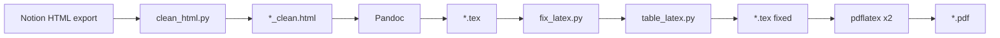

# Notion HTML → PDF (LaTeX pipeline)

Convert a **Notion HTML export** into a printable **PDF** with correct heading hierarchy, math, tables, images, and a clickable table of contents.

Designed for large course notes exported from Notion with KaTeX formulas, nested toggles, and `simple-table` blocks.

---

## Quick start

### Requirements

| Tool | Purpose |
|------|---------|
| **Python 3.10+** | HTML cleaning and LaTeX fixes |
| **Pandoc 3.x** | HTML → LaTeX |
| **pdflatex** (TeX Live or MacTeX) | PDF build |

Python packages: `beautifulsoup4`, `emoji` (see [Setup](#setup)).

### One command

```bash
cd "/path/to/Private & Shared 2"
chmod +x compila.sh   # once
./compila.sh automata.html
```

**Output** (when input is `automata.html`):

| File | Description |
|------|-------------|
| `automata_clean.html` | Preprocessed HTML for Pandoc |
| `automata.tex` | LaTeX source |
| `automata.pdf` | Final PDF |

Output names follow the input basename: `Export.html` → `Export_clean.html`, `Export.tex`, `Export.pdf`.

---

## Setup

```bash
python3 -m venv .venv
.venv/bin/pip install beautifulsoup4 emoji
```

Install Pandoc: https://pandoc.org/installing.html  

Install TeX (includes `pdflatex`): https://www.tug.org/texlive/ (or MacTeX on macOS).

---

## Pipeline overview



1. **clean_html.py** — Fix Notion-specific HTML so Pandoc behaves predictably.
2. **Pandoc** — Convert cleaned HTML to a standalone LaTeX document.
3. **fix_latex.py** — Post-process LaTeX (math, sections, TOC, figures, tables).
4. **pdflatex** (twice) — Build PDF and refresh the table of contents / page numbers.

`compila.sh` runs all four steps in order.

---

## Exporting from Notion

1. Open the Notion page (or workspace export).
2. Export as **HTML** (with subpages if needed).
3. Keep the **folder structure** from the export: image paths in the HTML (e.g. `Automata, Languages and Computing/Screenshot_....png`) must stay valid relative to the HTML file.
4. Place `automata.html` (or your export) in this project directory alongside the asset folders.

---

## Project structure

```
.
├── automata.html          # Input: raw Notion HTML export
├── automata_clean.html    # Generated: cleaned HTML
├── automata.tex           # Generated: LaTeX
├── automata.pdf           # Generated: PDF
├── compila.sh             # Full build script
├── clean_html.py          # Step 1: HTML preprocessing
├── fix_latex.py           # Step 3: LaTeX post-processing
├── table_latex.py         # Table conversion (used by fix_latex.py)
└── .venv/                 # Python virtual environment (optional)
```

### `clean_html.py`

Prepares Notion HTML before Pandoc:

| Step | What it does |
|------|----------------|
| Toggles → headings | Nested `<details>` become `<h1>`–`<h6>` (deepest first) |
| Table repair | Removes invalid `<div>` wrappers inside `<table>` so Pandoc emits real tables |
| Math | KaTeX `<annotation>` → MathML (inline) or `$$...$$` (display) |
| SVG removal | Drops SVG icons/images that break `pdflatex` |
| Emoji removal | Strips emoji characters |

```bash
.venv/bin/python clean_html.py automata.html
# writes automata_clean.html
```

### `fix_latex.py`

Fixes Pandoc/Notion artifacts in the `.tex` file:

| Area | Fix |
|------|-----|
| Structure | Section numbering `1.` / `1.1.` / `1.1.1.`; unnumbered cover page |
| TOC | Inserts `\tableofcontents` after the cover; clickable PDF links (`hyperref`) |
| Figures | `[H]` placement so images stay in document order |
| Math | Escaped `\$...\$`, `\textbackslash`, `gather*` / `cases`, Unicode symbols |
| Titles | Corrupted `\section{...}` with KaTeX / bookmarks |
| Captions | Removes empty `\caption{}` / spurious “Figure N” |
| Tables | Delegates to `table_latex.py` |

```bash
.venv/bin/python fix_latex.py automata.tex
```

### `table_latex.py`

Rebuilds Pandoc `longtable` environments:

- Replaces awkward `p{}` + `minipage` columns with `tabular` / `tabularx` + `booktabs`
- Uses `\shortstack` for multi-line cells
- Skips the Notion cover metadata table (website / status)
- Plain `l` columns for compact transition tables; `X` columns for wide text

---

## Manual build (step by step)

```bash
.venv/bin/python clean_html.py automata.html
pandoc automata_clean.html -f html -t latex -s -o automata.tex
.venv/bin/python fix_latex.py automata.tex
rm -f automata.aux automata.toc automata.out
pdflatex -interaction=nonstopmode automata.tex
pdflatex -interaction=nonstopmode automata.tex
```

The second `pdflatex` pass is **required** for a correct table of contents and page numbers.

---

## Troubleshooting

### `Missing \begin{document}` with hex garbage in `.aux`

The auxiliary file is corrupted (often after interrupting `pdflatex`):

```bash
rm -f automata.aux automata.toc automata.out
pdflatex -interaction=nonstopmode automata.tex
pdflatex -interaction=nonstopmode automata.tex
```

### `Package array Error` near `\end{tabularx}`

Usually a malformed table column spec from an older build. Re-run the full pipeline with `./compila.sh` so `table_latex.py` regenerates tables.

### Tables appear as separate text blocks (not columns)

The source HTML still has Notion `<div>` inside `<tbody>`. Re-run `clean_html.py` (table repair runs before math replacement).

### Empty or wrong table of contents

Run `pdflatex` **twice**. Delete `.toc` / `.aux` first if you changed section structure.

### Missing images in PDF

Check that image folders from the Notion export sit next to the HTML file with the **same relative paths** as in the export.

### `File ...sty not found`

Install a full TeX distribution (TeX Live / MacTeX). `pdflatex` needs packages such as `hyperref`, `booktabs`, `tabularx`, `float`.

---

## Customization

| Goal | Where to change |
|------|------------------|
| TOC depth (section levels) | `fix_latex.py` → `_add_table_of_contents()` (`tocdepth`) |
| First numbered section marker | `fix_latex.py` → `_add_table_of_contents()` (`marker`) |
| Cover page title | `fix_latex.py` → `_unnumbered_cover_section()` |
| Toggle → heading depth cap | `clean_html.py` → `h_level = min(1 + nesting_depth, 6)` |
| Skip a table from conversion | `table_latex.py` → `improve_longtable_block()` |
