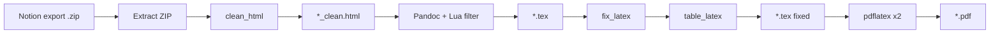

# Pipeline

Notion2Tex runs five steps in order:

## 1. Extract ZIP (`zip_export.py`)

Unpacks the Notion `.zip`, finds the main `.html` page, and resolves paths relative to the export folder.

## 2. Clean HTML (`clean_html.py`)

Prepares Notion HTML before Pandoc:

| Step | What it does |
|------|----------------|
| Toggles → headings | Nested `
` become `<h1>`–`<h6>` (deepest first) |
| Toggle lists | Flattens spurious list markup before paragraph toggles |
| Callouts | `<aside>` → `
` so Pandoc keeps its classes/attributes instead of dropping the wrapper; emoji icon stripped (pdfLaTeX has no color-emoji glyphs) |
| Code blocks | `<code class="language-X">` → `class="X"`, and the wrapping `<pre>`'s own attributes are cleared — both are required for Pandoc to apply syntax highlighting at all |
| Table repair | Removes invalid `
` wrappers inside `<table>` |
| Properties | Normalizes the cover metadata table |
| Images | Preserves Notion's display width and alignment (left/center/right); downloads any image Notion only linked to (page cover, "image from link", bookmark previews) into `notion2tex_downloads/`, omitted cleanly on failure |
| Math | Notion's `data-notion-equation`/`data-notion-inline-equation` (current export format) or legacy KaTeX `<annotation>` → MathML (inline) or display math, with fallback support for both |
| SVG removal | Drops SVG icons/images that break `pdflatex` |
| Emoji removal | Strips emoji characters from body text |

## 3. Pandoc + Lua filter

Converts cleaned HTML to a standalone LaTeX document. Pandoc's writer has no built-in handling for several things Notion needs, so a bundled Lua filter (`notion2tex/filters/notion_formatting.lua`) rewrites the Pandoc AST before output:

| Notion element | Filter output |
|-----------------|---------------|
| `<mark data-notion-highlight="COLOR">` | `\textcolor{}` |
| `<mark data-notion-highlight="COLOR_background">` | `\hl{}` (soul) with Notion's flattened pastel tone |
| `` (underline) | `\ul{}` (soul) |
| `
` | Side-by-side `minipage`s, sized from Notion's column ratios |
| Callout `
` | Rounded, colored `tcolorbox` |
| `<blockquote>` | `framed`'s `leftbar` (matches Notion's left-border quote style) |
| Web bookmark block | Bordered two-column card (title/description/link + preview image) |

In `--dark` mode, the filter reads a `NOTION2TEX_DARK` environment variable the pipeline sets, and swaps in colors tuned for a dark background instead of Notion's light-theme palette; code blocks get Pandoc's `breezedark` syntax theme.

Invoked as a subprocess with paths relative to the HTML file so images resolve correctly.

## 4. Fix LaTeX (`fix_latex.py`, `table_latex.py`, `image_sizes.py`)

Post-processes the `.tex` file:

| Area | Fix |
|------|-----|
| Structure | Section numbering `1.` / `1.1.` / `1.1.1.`; each top-level chapter starts on its own page (`\clearpage`) |
| Cover page | Merges the duplicated title (`\maketitle` + Notion's page-title heading) into one designed title page: large centered title above the cover image, vertically balanced, no header/footer |
| Running header | Book-style: the current chapter name at the top of every page, persisting across its subsections (via explicit `\sectionmark`/`\subsectionmark`, not the article-class default) |
| TOC | `\tableofcontents` after cover; roman numerals for front matter, arabic from page 1 for body |
| Figures | `[H]` placement; alignment (left/center/right) per Notion's own setting; image path fixes; AVIF → PNG on macOS via `sips` |
| Math | Escaped `\$...\$` / `\$\$...\$\$`, `\textbackslash`, `gather*` / `cases`, Unicode symbols |
| Titles | Corrupted `\section{...}` with KaTeX / bookmarks |
| Captions | Removes empty `\caption{}` / spurious “Figure N” |
| Tables | Rebuilds `longtable` → `tabular` / `tabularx` with `booktabs` |
| Strikeout/underline | `soul` → `ulem` → no-op if packages missing |
| Dark mode (`--dark`) | Dark gray `\pagecolor`, light default text color, dark-friendly link colors — applied last, since headers/footers and floats (tables, figures) are boxed separately by LaTeX and don't inherit the page's ambient text color |

## 5. Build PDF (`pdflatex`)

Runs `pdflatex` twice so the table of contents and page numbers are correct. Intermediate LaTeX artifacts are cleaned up after success (`cleanup.py`).

## Entry points

- **CLI:** `notion2tex` → `notion2tex.cli:main`
- **Python:** `notion2tex.pipeline.convert()`
